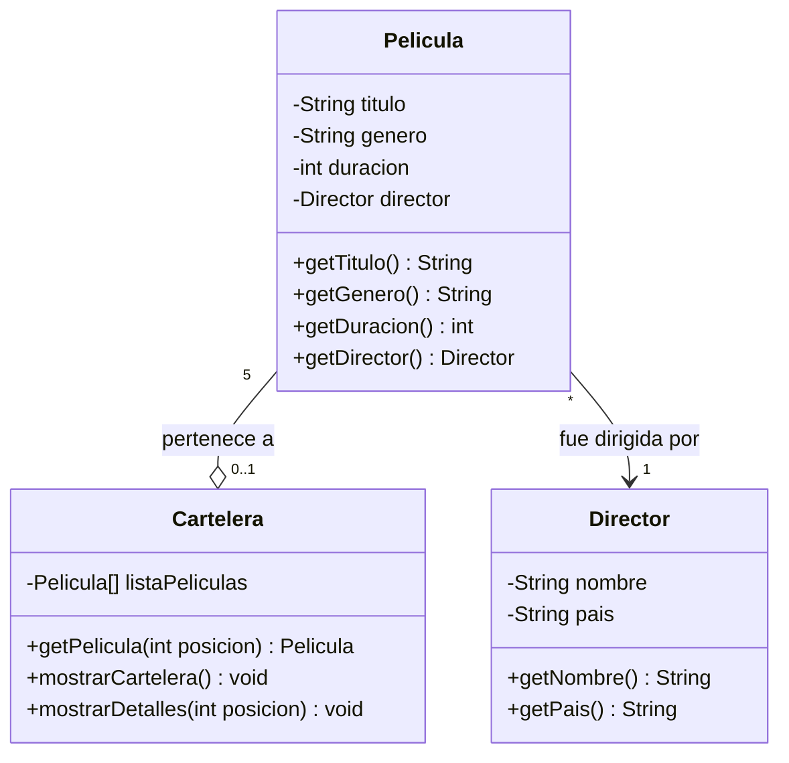

# Cartelera - Caso Práctico #1 🎥🎬

Proyecto de **Estructura de Datos** (Ingeniería en TI) desarrollado en Java.

## Integrantes

- Angel Marco Martinez Cobos
- Eduardo Daniel Vazquez Diaz 

## Planteamiento del problema

> **Ejercicio #1**
>
> En una sala de cine, se exhibe un tablero con la información de las cinco películas proyectadas para el fin de semana.
>
> De cada película se detalla el título, el género, la duración en minutos y el director; de este último, se incluye su nombre y su país de origen.
>
> Los espectadores pueden consultar el listado completo de las películas y, si alguna resulta de su interés, consultar los detalles.

## Descripción de la solución

El programa muestra una cartelera con cinco películas almacenadas en un **arreglo estático**. El usuario (cinéfilo) puede ver el listado, consultar los detalles de una película y salir del programa.

## Diagrama de casos de uso

**Justificación:** El usuario no conecta directamente con "Ver detalles" por que primero necesita acceder a la cartelera para poder ver los detalles, por lo mismo es una conexión << extend >> por que su usabilidad esta sujeta a la decisión del usuario, no es obligatorio esta acción. 

## Diagrama de clases

**Justificación:** En este caso cada película fue dirigida por un unico director y un director puede tener múltiples películas, asi como una película puede pertenecer o no a una Cartelera, pero la cartelera si tiene que tener como mínimo 5 películas.

## Tecnologías

- Java
- Mermaid y PlantUML para los diagramas
